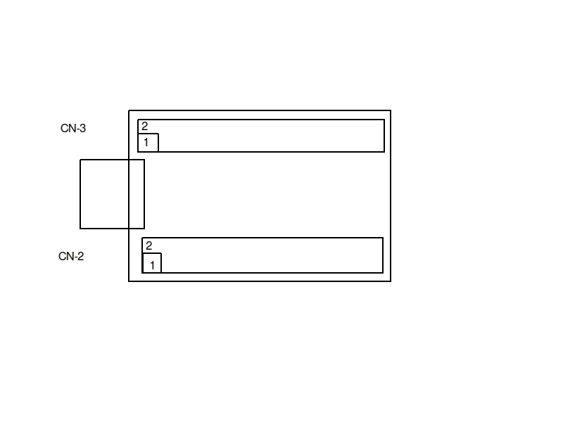

## JTAG debugging

### Connecting the pins
Connect the pins on the headers accordingly

| FTH2232 | To              |
| :-:     | :-:             |
| CN3-1(VCC) | CN3-3(VCC)   |
| CN2-2(GND) | ESP GND      |
| CN2-7(AD0) | ESP TCK (G13)|
| CN2-8(AD1) | ESP TDI (G12)|
| CN2-9(AD2) | ESP TDO (G15)|
|CN2-10(AD3) | ESP TMS (G14)|

The CNx-x numbers are based on the CMJU-FT2232HL
Which differ from the mini



### Software
Run openocd. This will open up the possibility to connect a remote gdb
```
openocd-esp32 -f ft2232hl.cfg -f esp32.cfg
```

To connect a remote gdb session run

```
xtensa-esp32-elf-gdb <path/to/firmware.elf>

(gdb) target remote localhost:3333
```
